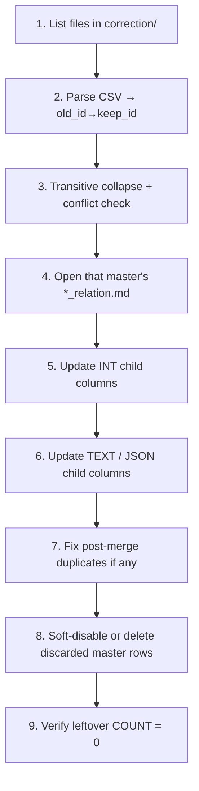

# Remapping correction — index

> **Purpose:** Deduplicate master lookup rows and rewrite every child reference (`old_id → keep_id`).  
> **Source of truth for columns:** `src/db/schema.ts`  
> **ID maps:** CSV files in `correction/`  
> **Important:** No formal FKs — links are logical columns joined in app code.

## Per-table relation docs

| Master table | Relation doc | CSV patterns in `correction/` |
|--------------|--------------|--------------------------------|
| `cyb_cities` | [cities_relation.md](./cities_relation.md) | `city*.csv`, `cities*.csv` |
| `cyb_designation` | [designation_relation.md](./designation_relation.md) | `designation*.csv`, `degination*.csv` |
| `cyb_department` | [department_relation.md](./department_relation.md) | `department*.csv` |
| `cyb_industries` | [industries_relation.md](./industries_relation.md) | `industry*.csv`, `industries*.csv` |
| `cyb_skill` | [skill_relation.md](./skill_relation.md) | `skill*.csv`, `skills*.csv` |

Prefer remap order when several CSVs exist: **cities → designation → department → industries → skill**.

---

## CSV correction input

**Directory:**

```text
src/api-ai-document/remapping_correction/correction/
```

Any remap **must** load maps from CSVs here. Do not invent `old_id → keep_id` pairs.

### Expected columns

| Role | Accepted headers | Required |
|------|------------------|----------|
| **old_id** | `old_id`, `from_id`, `source_id`, `bad_id`, `duplicate_id`, `id` | yes |
| **keep_id** | `keep_id`, `to_id`, `target_id`, `new_id`, `correct_id`, `canonical_id` | yes |
| **entity** | `type`, `entity`, `table`, `master` | only for combined multi-master CSV |
| **name** | `name`, `old_name`, `label` | optional (audit) |

```csv
old_id,keep_id,name
1,3,Delhi
6,3,new-delhi
```

### Build map rules

1. Read CSVs for the master being remapped.
2. Build `Map<old_id, keep_id>`.
3. Skip `old_id === keep_id`.
4. Reject empty / non-numeric `keep_id`.
5. **Transitive collapse:** `A→B` and `B→C` → `A→C`, `B→C`.
6. **Conflict:** same `old_id` → two different `keep_id`s → **stop**.
7. Ensure each final `keep_id` remains in the master table.
8. `discard_ids` = old ids that are not a final keep id.

If `correction/` is empty → wait for CSVs; do not invent mappings. See [correction/README.md](./correction/README.md).

---

## Column types (all masters)

| Storage | How to remap |
|---------|--------------|
| `int` | `UPDATE t SET col = :keep WHERE col IN (:discard…)` or `CASE` for many pairs |
| `text` single id | rewrite carefully (string + numeric forms) |
| `text` JSON id array | parse → map each id → dedupe → stringify |
| `text` CSV ids | split → map → join → dedupe |

---

## Shared runbook



| Step | Action |
|------|--------|
| 1 | Drop CSVs into `correction/` |
| 2 | Open the matching `*_relation.md` |
| 3 | Parse CSV → validated map |
| 4 | Update every child column listed in that file |
| 5 | Handle text/JSON + uniqueness rules |
| 6 | Cleanup discarded master rows (never delete `keep_id`) |
| 7 | Verify leftover counts = 0 |
| 8 | Record CSV filename + row count applied |

**Do not:** invent id pairs, skip text columns, or delete master rows before children are remapped.

---

## Tables that touch multiple masters

| Table | City | Designation | Department | Industry | Skill |
|-------|:----:|:-----------:|:----------:|:--------:|:-----:|
| `cyb_user` | ✓ | ✓ (`current_possition`) | | ✓ | |
| `cyb_user_experience` | ✓ | ✓ | ✓ | | ✓ (text) |
| `cyb_company_job` | ✓ | ✓ | ✓ | ✓ | ✓ (text) |
| `cyb_job_template` | ✓ | ✓ | ✓ | ✓ | ✓ (text) |
| `cyb_job_meta` | ✓ (text) | ✓ (text) | ✓ (text) | | |
| `cyb_user_education` | ✓ | | | | |
| `cyb_company_invite` | | | | ✓ | |
| `cyb_user_update_experience` | | ✓ | | | |
| `cyb_user_update_experience_history` | | ✓ | | | |
| `cyb_user_skill` | | | | | ✓ |
| `cyb_skill_rating` | | | | | ✓ |
| `cyb_skill_rating_history` | | | | | ✓ |

---

## Status

- Split into one relation file per master table  
- ID maps: `correction/*.csv`  
- No formal FK constraints in schema  
