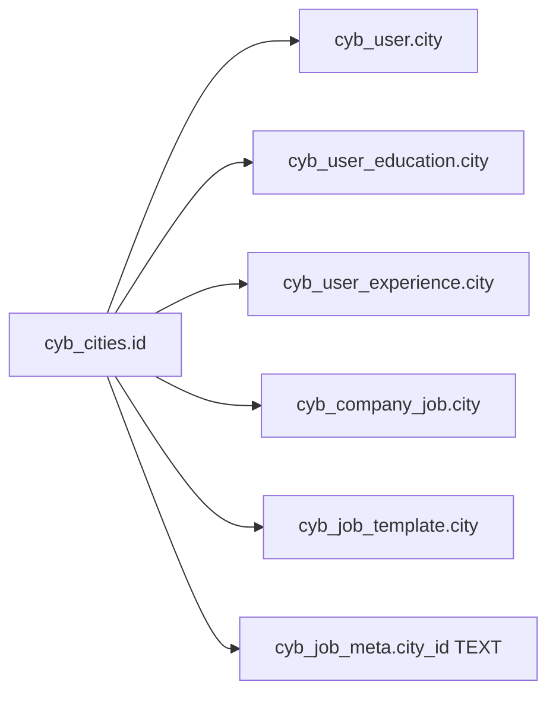
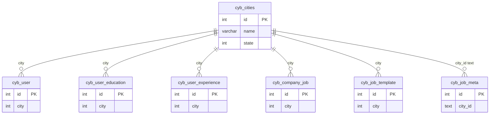

# Cities — ID relation map

> **Master table:** `cyb_cities`  
> **PK:** `id`  
> **Drizzle:** `cybCities`  
> **CSV input:** `correction/city*.csv`, `correction/cities*.csv`  
> **Shared rules:** [README.md](./README.md)

When CSV maps discard ids → keep id (e.g. `1→3`, `6→3`), update **every** child column below, then soft-disable/delete discarded master rows.

---

## Master

```text
cyb_cities
  id          int PK
  name        varchar
  state       int  → cyb_state.id  (parent only; not a city-id remap target)
  status      int
```

---

## Child columns to remap

| # | Table | Column | Type | Remap style |
|---|-------|--------|------|-------------|
| 1 | `cyb_user` | `city` | int | simple |
| 2 | `cyb_user_education` | `city` | int | simple |
| 3 | `cyb_user_experience` | `city` | int | simple |
| 4 | `cyb_company_job` | `city` | int | simple |
| 5 | `cyb_job_template` | `city` | int | simple |
| 6 | `cyb_job_meta` | `city_id` | **text** | text-aware |

---

## Diagram





---

## SQL patterns

**Same keep id for many discard ids:**

```sql
UPDATE cyb_user SET city = :keep WHERE city IN (:discard_ids);
UPDATE cyb_user_education SET city = :keep WHERE city IN (:discard_ids);
UPDATE cyb_user_experience SET city = :keep WHERE city IN (:discard_ids);
UPDATE cyb_company_job SET city = :keep WHERE city IN (:discard_ids);
UPDATE cyb_job_template SET city = :keep WHERE city IN (:discard_ids);
```

**Many different pairs:**

```sql
UPDATE cyb_user
SET city = CASE city
  WHEN 1 THEN 3
  WHEN 6 THEN 3
  ELSE city
END
WHERE city IN (1, 6);
-- repeat CASE for each int table above
```

**Text column `cyb_job_meta.city_id`:** rewrite stored text (may be single id string or multi-id text). Do not use naive `LIKE '%1%'` without care.

---

## Verification

Build `discard_ids` from the city CSV (after transitive collapse). All leftover counts must be **0**:

```sql
SELECT 'cyb_user' AS t, COUNT(*) AS leftover FROM cyb_user WHERE city IN (/* discard_ids */)
UNION ALL
SELECT 'cyb_user_education', COUNT(*) FROM cyb_user_education WHERE city IN (/* discard_ids */)
UNION ALL
SELECT 'cyb_user_experience', COUNT(*) FROM cyb_user_experience WHERE city IN (/* discard_ids */)
UNION ALL
SELECT 'cyb_company_job', COUNT(*) FROM cyb_company_job WHERE city IN (/* discard_ids */)
UNION ALL
SELECT 'cyb_job_template', COUNT(*) FROM cyb_job_template WHERE city IN (/* discard_ids */);
-- Inspect cyb_job_meta.city_id as TEXT separately.
```

Then cleanup discarded rows on `cyb_cities` only after children are clean.

---

## Example

```csv
old_id,keep_id,name
1,3,Delhi
6,3,new-delhi
```

Keep `cyb_cities.id = 3` (`new Delhi`). Remap `1` and `6` everywhere listed above.
