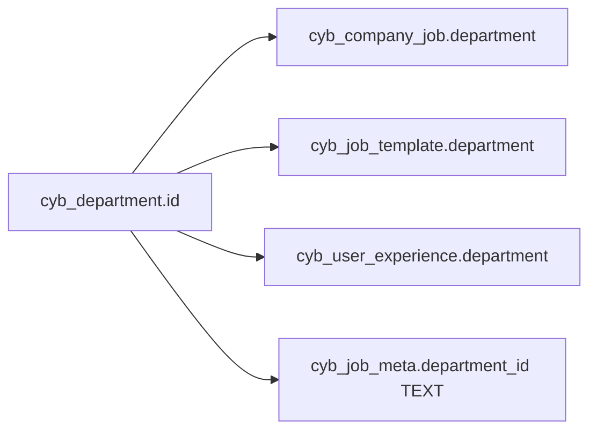
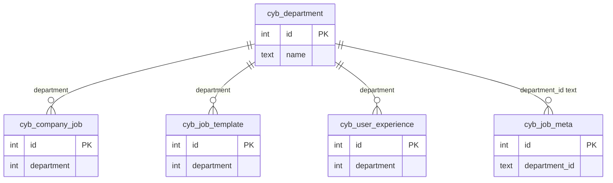

# Department — ID relation map

> **Master table:** `cyb_department`  
> **PK:** `id`  
> **Drizzle:** `cybDepartment`  
> **CSV input:** `correction/department*.csv`  
> **Shared rules:** [README.md](./README.md)

---

## Master

```text
cyb_department
  id          int PK
  name        text
  status      int
```

---

## Child columns to remap

| # | Table | Column | Type | Remap style |
|---|-------|--------|------|-------------|
| 1 | `cyb_company_job` | `department` | int | simple |
| 2 | `cyb_job_template` | `department` | int | simple |
| 3 | `cyb_user_experience` | `department` | int | simple |
| 4 | `cyb_job_meta` | `department_id` | **text** | text-aware |

---

## Diagram





---

## SQL patterns

```sql
UPDATE cyb_company_job SET department = :keep WHERE department IN (/* discard_ids */);
UPDATE cyb_job_template SET department = :keep WHERE department IN (/* discard_ids */);
UPDATE cyb_user_experience SET department = :keep WHERE department IN (/* discard_ids */);
```

**Text:** rewrite `cyb_job_meta.department_id` carefully.

**Many pairs:** use `CASE col WHEN old THEN keep … END WHERE col IN (...)`.

---

## Verification

```sql
SELECT 'cyb_company_job' AS t, COUNT(*) AS leftover FROM cyb_company_job WHERE department IN (/* discard_ids */)
UNION ALL
SELECT 'cyb_job_template', COUNT(*) FROM cyb_job_template WHERE department IN (/* discard_ids */)
UNION ALL
SELECT 'cyb_user_experience', COUNT(*) FROM cyb_user_experience WHERE department IN (/* discard_ids */);
-- Inspect cyb_job_meta.department_id as TEXT separately.
```

Then cleanup discarded rows on `cyb_department`.
