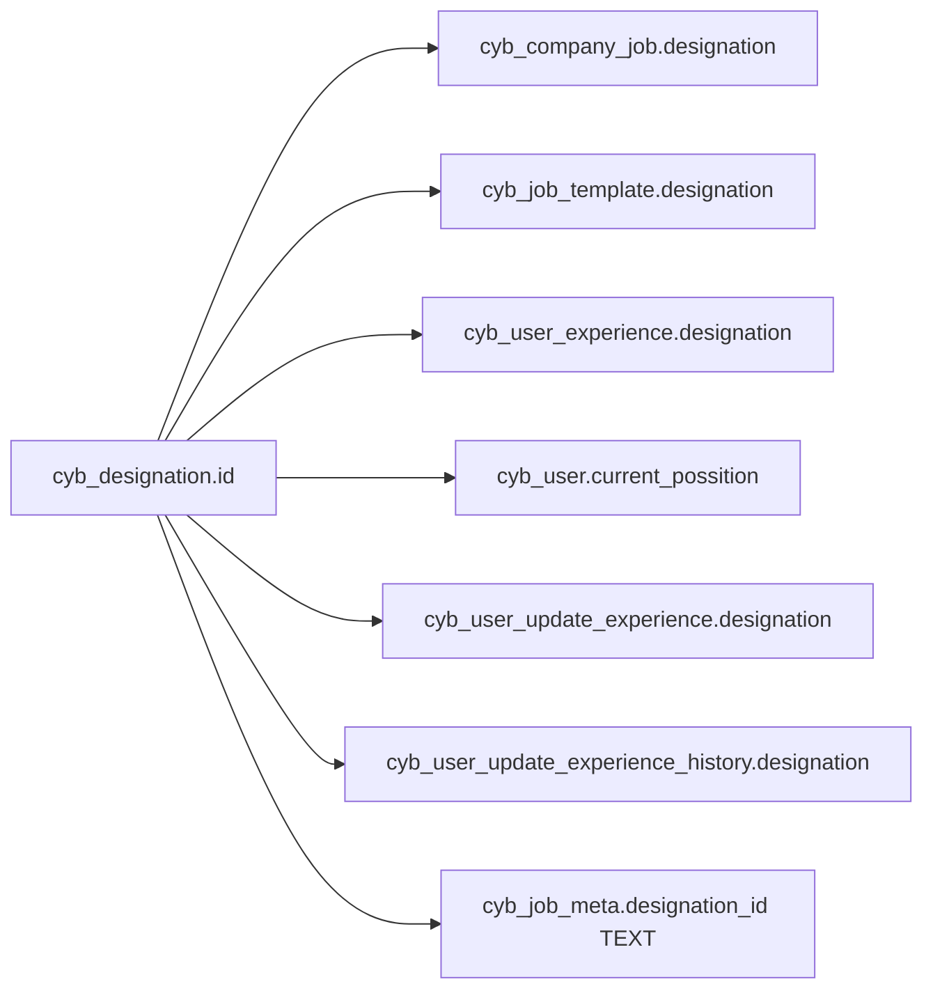
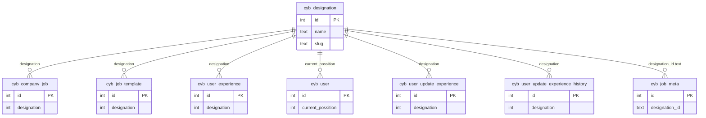

# Designation — ID relation map

> **Master table:** `cyb_designation`  
> **PK:** `id`  
> **Drizzle:** `cybDesignation`  
> **CSV input:** `correction/designation*.csv`, `correction/degination*.csv`  
> **Shared rules:** [README.md](./README.md)

Informal names: designation / degination.  
**Note:** `cyb_user.current_possition` stores a **designation** id (confirmed by app joins).

---

## Master

```text
cyb_designation
  id          int PK
  name        text
  slug        text
  status      int
```

---

## Child columns to remap

| # | Table | Column | Type | Remap style |
|---|-------|--------|------|-------------|
| 1 | `cyb_company_job` | `designation` | int | simple |
| 2 | `cyb_job_template` | `designation` | int | simple |
| 3 | `cyb_user_experience` | `designation` | int | simple |
| 4 | `cyb_user` | `current_possition` | int | simple — **this is designation** |
| 5 | `cyb_user_update_experience` | `designation` | int | simple |
| 6 | `cyb_user_update_experience_history` | `designation` | int | simple |
| 7 | `cyb_job_meta` | `designation_id` | **text** | text-aware |

---

## Diagram





---

## SQL patterns

```sql
UPDATE cyb_company_job SET designation = :keep WHERE designation IN (/* discard_ids */);
UPDATE cyb_job_template SET designation = :keep WHERE designation IN (/* discard_ids */);
UPDATE cyb_user_experience SET designation = :keep WHERE designation IN (/* discard_ids */);
UPDATE cyb_user SET current_possition = :keep WHERE current_possition IN (/* discard_ids */);
UPDATE cyb_user_update_experience SET designation = :keep WHERE designation IN (/* discard_ids */);
UPDATE cyb_user_update_experience_history SET designation = :keep WHERE designation IN (/* discard_ids */);
```

**Text:** rewrite `cyb_job_meta.designation_id` carefully.

**Many pairs:** use `CASE col WHEN old THEN keep … END WHERE col IN (...)`.

---

## Verification

```sql
SELECT 'cyb_company_job' AS t, COUNT(*) AS leftover FROM cyb_company_job WHERE designation IN (/* discard_ids */)
UNION ALL
SELECT 'cyb_job_template', COUNT(*) FROM cyb_job_template WHERE designation IN (/* discard_ids */)
UNION ALL
SELECT 'cyb_user_experience', COUNT(*) FROM cyb_user_experience WHERE designation IN (/* discard_ids */)
UNION ALL
SELECT 'cyb_user.current_possition', COUNT(*) FROM cyb_user WHERE current_possition IN (/* discard_ids */)
UNION ALL
SELECT 'cyb_user_update_experience', COUNT(*) FROM cyb_user_update_experience WHERE designation IN (/* discard_ids */)
UNION ALL
SELECT 'cyb_user_update_experience_history', COUNT(*) FROM cyb_user_update_experience_history WHERE designation IN (/* discard_ids */);
-- Inspect cyb_job_meta.designation_id as TEXT separately.
```

Then cleanup discarded rows on `cyb_designation`.
