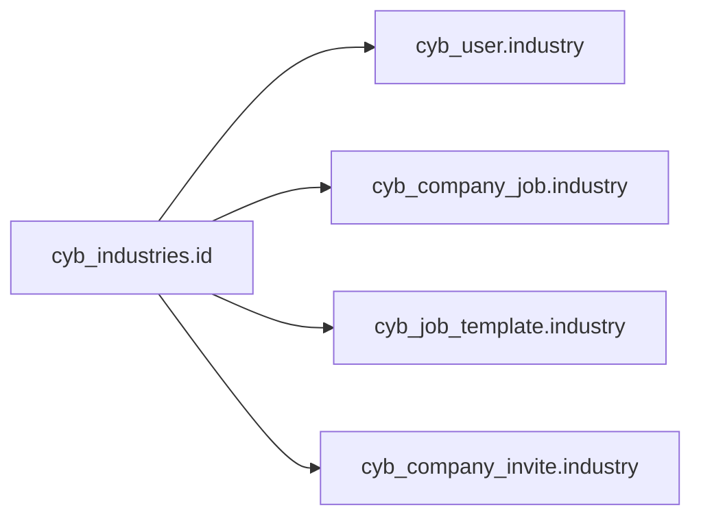
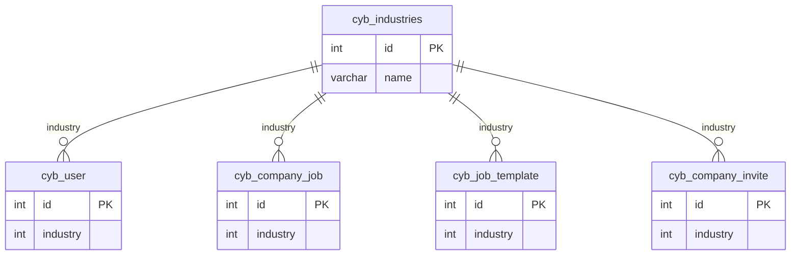

# Industries — ID relation map

> **Master table:** `cyb_industries`  
> **PK:** `id`  
> **Drizzle:** `cybIndustries`  
> **CSV input:** `correction/industry*.csv`, `correction/industries*.csv`  
> **Shared rules:** [README.md](./README.md)

Informal name: industry.

---

## Master

```text
cyb_industries
  id          int PK
  name        varchar
  status      int
  is_deleted  int
```

---

## Child columns to remap

| # | Table | Column | Type | Remap style |
|---|-------|--------|------|-------------|
| 1 | `cyb_user` | `industry` | int | simple |
| 2 | `cyb_company_job` | `industry` | int | simple |
| 3 | `cyb_job_template` | `industry` | int | simple |
| 4 | `cyb_company_invite` | `industry` | int | simple |

All industry references in schema are **int** (no text multi-id field for industry).

---

## Diagram





---

## SQL patterns

```sql
UPDATE cyb_user SET industry = :keep WHERE industry IN (/* discard_ids */);
UPDATE cyb_company_job SET industry = :keep WHERE industry IN (/* discard_ids */);
UPDATE cyb_job_template SET industry = :keep WHERE industry IN (/* discard_ids */);
UPDATE cyb_company_invite SET industry = :keep WHERE industry IN (/* discard_ids */);
```

**Many pairs:**

```sql
UPDATE cyb_user
SET industry = CASE industry
  WHEN 10 THEN 12
  WHEN 11 THEN 12
  ELSE industry
END
WHERE industry IN (10, 11);
-- same CASE pattern for other int tables
```

---

## Verification

```sql
SELECT 'cyb_user' AS t, COUNT(*) AS leftover FROM cyb_user WHERE industry IN (/* discard_ids */)
UNION ALL
SELECT 'cyb_company_job', COUNT(*) FROM cyb_company_job WHERE industry IN (/* discard_ids */)
UNION ALL
SELECT 'cyb_job_template', COUNT(*) FROM cyb_job_template WHERE industry IN (/* discard_ids */)
UNION ALL
SELECT 'cyb_company_invite', COUNT(*) FROM cyb_company_invite WHERE industry IN (/* discard_ids */);
```

Then cleanup discarded rows on `cyb_industries` (or set `status = 0` / `is_deleted = 1` if soft-delete is preferred).
