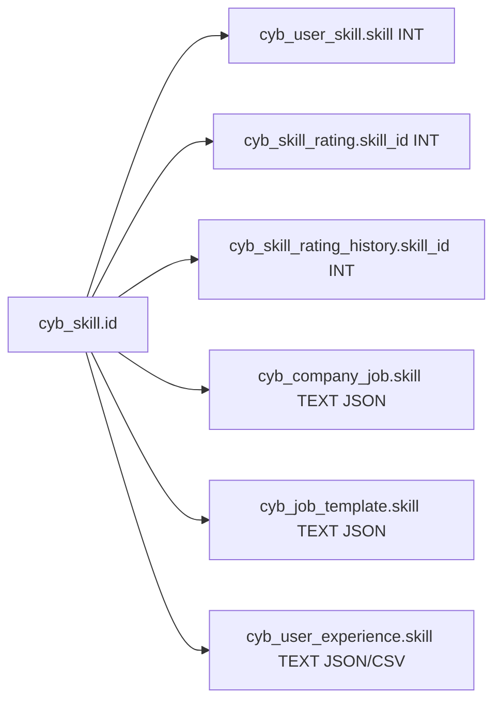
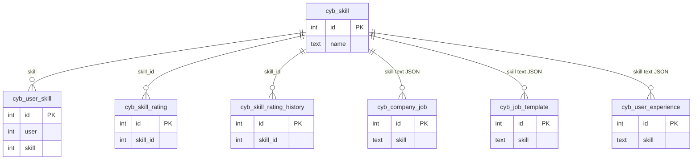

# Skill — ID relation map

> **Master table:** `cyb_skill`  
> **PK:** `id`  
> **Drizzle:** `cybSkill`  
> **CSV input:** `correction/skill*.csv`, `correction/skills*.csv`  
> **Shared rules:** [README.md](./README.md)

Informal name: skills.  
Prefer remapping **skill last** among the five masters (JSON text fields + uniqueness on `cyb_user_skill`).

---

## Master

```text
cyb_skill
  id          int PK
  name        text
  status      int
```

---

## Child columns to remap

| # | Table | Column | Type | Remap style |
|---|-------|--------|------|-------------|
| 1 | `cyb_user_skill` | `skill` | int | simple — then **dedupe (user, skill)** |
| 2 | `cyb_skill_rating` | `skill_id` | int | simple |
| 3 | `cyb_skill_rating_history` | `skill_id` | int | simple |
| 4 | `cyb_company_job` | `skill` | **text** | JSON array of ids |
| 5 | `cyb_job_template` | `skill` | **text** | JSON array of ids |
| 6 | `cyb_user_experience` | `skill` | **text** | JSON array on write; some readers use `split(',')` |

### Text skill format

App writes often use `JSON.stringify([1, 2, 3])`. Some reads use `split(',')`. Remap script should:

1. Try `JSON.parse`
2. Else split on comma
3. Map each id through `old_id → keep_id`
4. **Dedupe** (two old ids may collapse to one keep id)
5. Write back as JSON array string

```text
for each row where skill is not null:
  ids = JSON.parse(skill) or skill.split(',')
  ids = unique(ids.map(id => map.get(id) ?? id))
  row.skill = JSON.stringify(ids)
```

### Post-merge uniqueness: `cyb_user_skill`

After int remap, same `user` may have two rows with the same `skill`. Keep one (prefer higher `rating` / non-deleted / min `id`); delete or soft-delete the rest (`is_deleted = 1`).

---

## Diagram





---

## SQL patterns (int only)

```sql
UPDATE cyb_user_skill SET skill = :keep WHERE skill IN (/* discard_ids */);
UPDATE cyb_skill_rating SET skill_id = :keep WHERE skill_id IN (/* discard_ids */);
UPDATE cyb_skill_rating_history SET skill_id = :keep WHERE skill_id IN (/* discard_ids */);
```

Then run duplicate cleanup on `cyb_user_skill`.  
Text columns on job / template / experience need a script (not a single simple `UPDATE … IN (...)`).

---

## Verification

```sql
SELECT 'cyb_user_skill' AS t, COUNT(*) AS leftover FROM cyb_user_skill WHERE skill IN (/* discard_ids */)
UNION ALL
SELECT 'cyb_skill_rating', COUNT(*) FROM cyb_skill_rating WHERE skill_id IN (/* discard_ids */)
UNION ALL
SELECT 'cyb_skill_rating_history', COUNT(*) FROM cyb_skill_rating_history WHERE skill_id IN (/* discard_ids */);
-- Text fields: scan cyb_company_job.skill, cyb_job_template.skill, cyb_user_experience.skill
-- for any remaining discard ids inside JSON/CSV strings.
```

Then cleanup discarded rows on `cyb_skill`.
