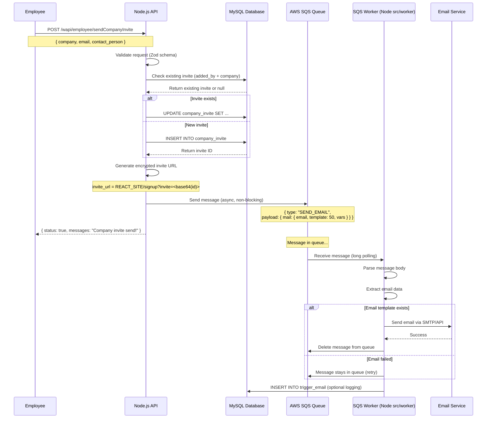
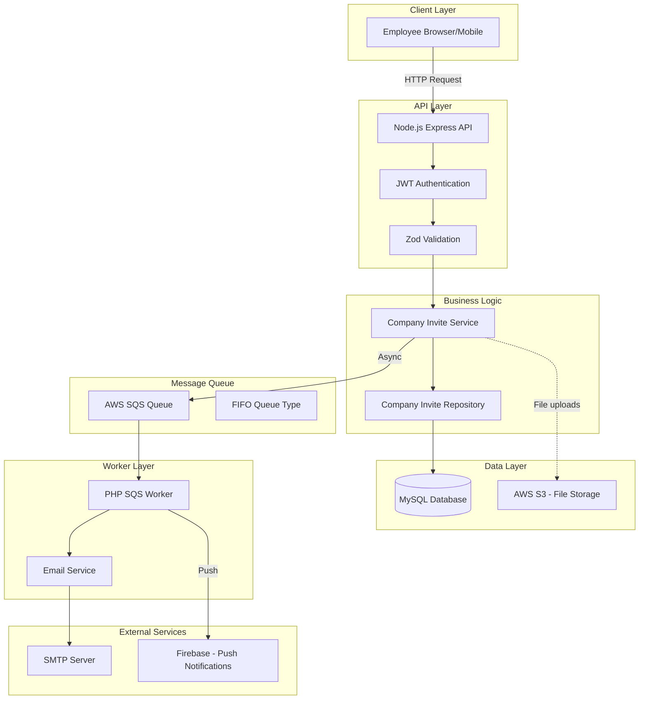
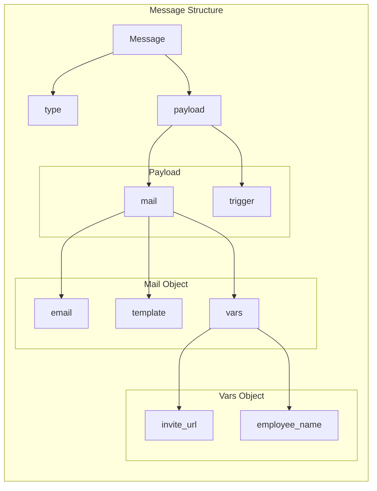
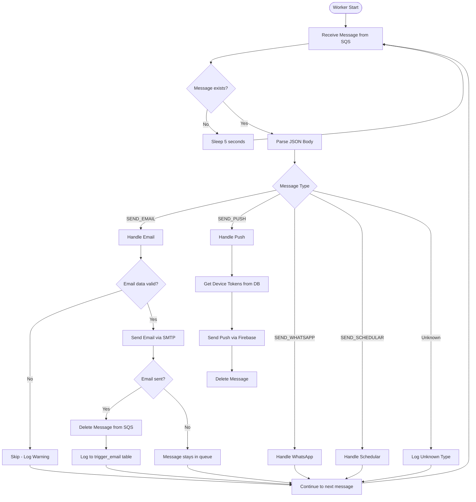
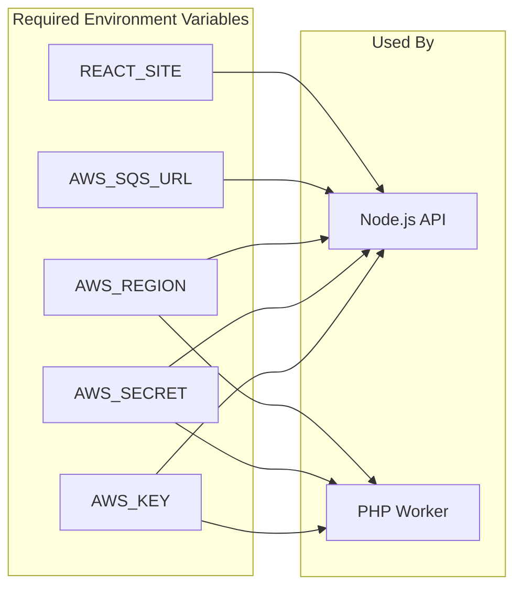

# SQS Email Queue Flow Diagram

> **Stack:** Node.js API + SQS · worker under `src/worker/`  
> **Related:** [sendCompanyInvite.md](./sendCompanyInvite.md) · `utils/sqs.ts`

## Overview

This diagram shows how the `sendCompanyInvite` endpoint uses AWS SQS to send email notifications asynchronously.

---

## Flow Diagram (Mermaid)

---

## Architecture Diagram

---

## SQS Message Format

---

## SQS Worker Processing Flow

---

## Environment Variables

---

## Key Points

1. **Asynchronous Processing**: Email is sent via SQS, not synchronously in the API request
2. **Non-blocking**: API returns success immediately after queuing the message
3. **Retry**: If email fails, message stays in queue for retry
4. **Long Polling**: Worker uses 20-second long polling to reduce empty reads
5. **FIFO Queue**: Ensures message ordering and deduplication
6. **Error Handling**: Failed messages are not deleted, allowing SQS to retry

---

## Diagram Files

Save this file as: `src/api-ai-document/sqs-flow-diagram.md`

This diagram can be rendered in:
- GitHub/GitLab markdown
- VS Code with Mermaid extension
- Any Mermaid-compatible viewer
